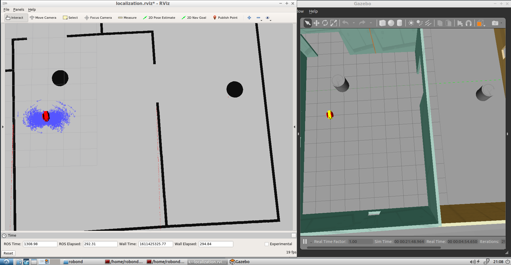
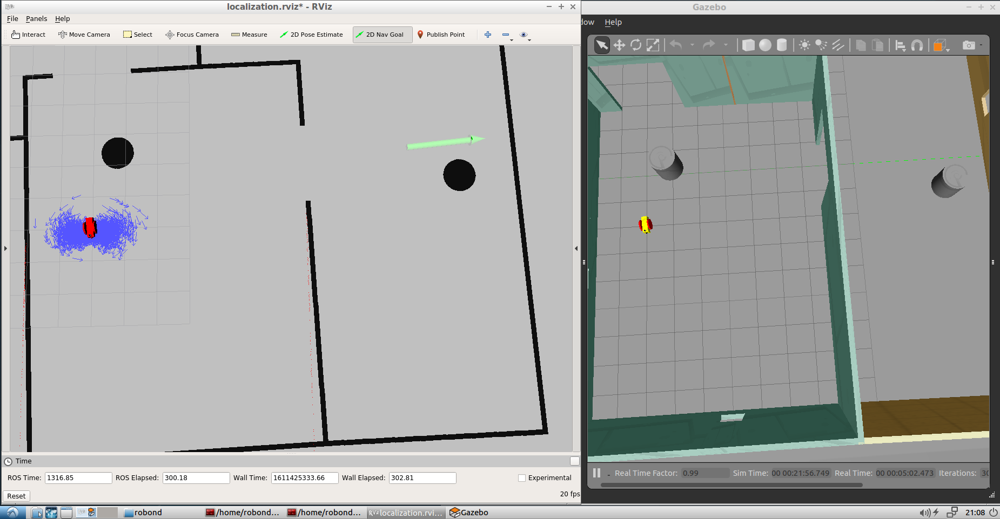
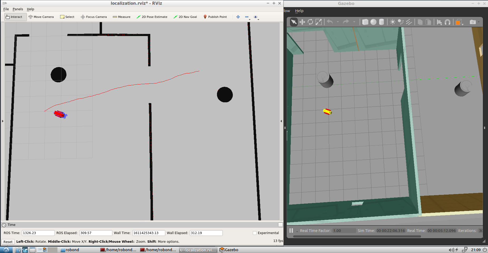
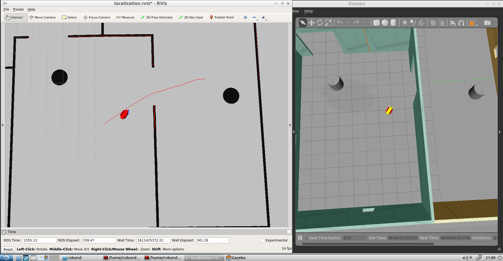
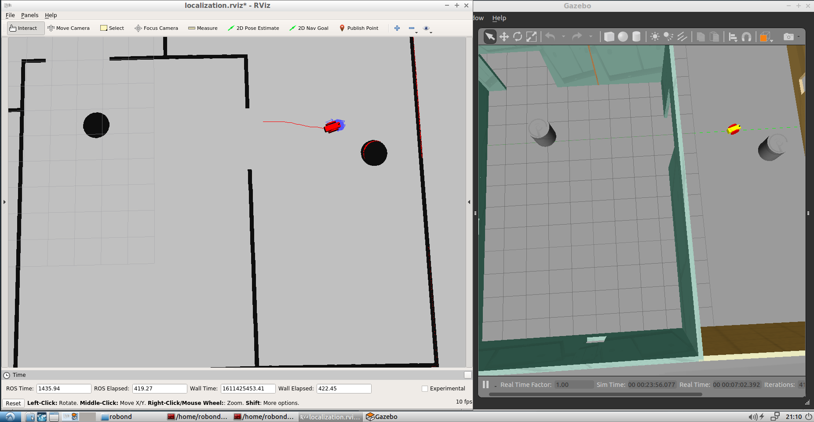

# Where Am I?

This is the third project of Udacity's Robotics Software Engineer Nanodegree. I used my robot and the world from [previous project](https://github.com/korhanmd/udacity-go-chase-it).
I changed world to become easier to localize and used AMCL package to localize robot in the world.

You need to clone this repo to the `src` folder of a `catkin_ws`. To run the application write `roslaunch my_robot world.launch` to the terminal in the root directory of catkin_ws.
In another terminal write `roslaunch my_robot amcl.launch`.

There are three packages in the project. `my_robot` and `ball_chaser` packages are from previous project. `pgm_map_creator` is for creating map of the world.
Added `amcl.launch` to the `my_robot` package. This launch file includes nodes for localization such as `map_server`, `amcl`, `move_base`.

## Screenshots from RViz and Gazebo while robot moving to the target

Before started to move. Blue arrows indicates particle filters.

Setting a goal to the robot.

When robot started to move.

Halfway through to the goal point.

At the goal point.

